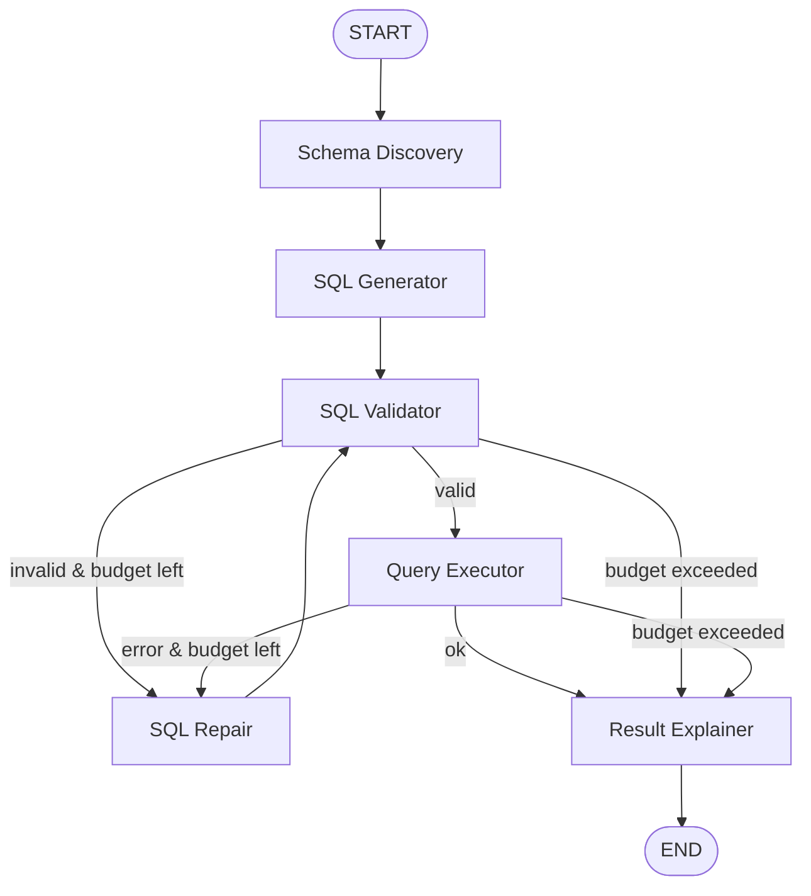

# 🤖 SQL Database Agent

An advanced, production-grade Natural Language to SQL (NL2SQL) agent built with **FastAPI** and **LangGraph**. It automatically discovers database schemas, safely generates and validates SQL queries, self-heals syntax or execution errors via a repair loop, and generates natural-language explanations and interactive charts.

---

## 📐 Architecture & Topology

The agent uses a structured **LangGraph** state graph designed to route queries through a self-healing pipeline. If a query fails validation or execution, it enters the `sql_repair` loop to fix itself before returning the result.



### Key Workflow Components:
1. **Schema Discovery (`schema_discovery`)**: Dynamically queries the database metadata (tables, columns, types, keys) to provide context for the model.
2. **SQL Generator (`sql_generator`)**: Translates the user's natural language question into a target SQL query.
3. **SQL Validator (`sql_validator`)**: Parses and validates the SQL against forbidden keywords (`DROP`, `DELETE`, `TRUNCATE`, etc.) to prevent dangerous operations.
4. **SQL Repair (`sql_repair`)**: Auto-heals failed SQL statements using execution/validation error traces (up to `MAX_REPAIR_ATTEMPTS`).
5. **Query Executor (`query_executor`)**: Connects to the database and runs the query safely with user-configurable limits.
6. **Result Explainer (`result_explainer`)**: Interprets the raw tabular data and formats a user-friendly summary, proposing follow-up questions and chart recommendations.

---

## 🛠️ Tech Stack

### Backend
* **FastAPI**: REST API layer with support for Server-Sent Events (SSE) streaming.
* **LangGraph & LangChain**: Graph orchestration and LLM integrations.
* **SQLAlchemy**: Safe database connections and metadata reflection.
* **SlowAPI**: Rate limiting for API endpoints.
* **Uvicorn**: High-performance ASGI web server.

### Frontend
* **Vite + React (TypeScript)**: Fast, type-safe interactive UI.
* **Recharts**: Responsive chart generation (Bar, Line, Pie, Area) inferred by the agent.
* **Tailwind CSS**: Sleek glassmorphism and modern UI components.

### Databases Supported
* **SQLite** (local `.db` files)
* **PostgreSQL** (fully supported in Docker / Production setups)

---

## 🚀 Quick Start (Local Setup)

Follow these steps to run the backend and frontend locally on Windows, macOS, or Linux.

### Prerequisites
* Python `3.11` or higher
* Node.js `18` or higher
* npm or yarn

### 1. Backend Setup

1. Navigate to the `backend` directory:
   ```bash
   cd backend
   ```
2. Create and activate a Python virtual environment:
   ```bash
   python -m venv .venv
   # Windows:
   .venv\Scripts\activate
   # macOS/Linux:
   source .venv/bin/activate
   ```
3. Install dependencies:
   ```bash
   pip install -e .
   ```
4. Copy the environment template and set up your variables:
   ```bash
   cp .env.example .env
   ```
   Ensure you configure the `LLM_PROVIDER` (e.g. `gemini` or `openai`) and provide the corresponding API key.

5. Seed the local SQLite database(s):
   ```bash
   # Create the default complex sales database
   python ../scripts/setup_sqlite.py
   # Or create the Amazon synthetic test database
   python ../create_amazon_test_db.py
   ```

6. Start the backend server:
   ```bash
   uvicorn app.main:app --host 0.0.0.0 --port 8000 --reload
   ```

---

### 2. Frontend Setup

1. Navigate to the `frontend` directory:
   ```bash
   cd ../frontend
   ```
2. Install npm packages:
   ```bash
   npm install
   ```
3. Start the Vite development server:
   ```bash
   npm run dev
   ```
   The frontend will run at `http://localhost:5173/` and proxy requests to `http://localhost:8000/`.

---

## 🐳 Docker Setup (One-Command Full Stack)

If you have Docker and Docker Compose installed, you can launch the Postgres database, FastAPI backend, and React frontend in a unified environment.

```bash
docker compose --env-file .env up --build
```

* **Frontend**: `http://localhost:3000`
* **Backend API**: `http://localhost:8000`
* **PostgreSQL DB**: `localhost:5432` (automatically initialized with `db/schema.sql`)

---

## ⚙️ Configuration (.env)

Key variables in the `.env` file:

| Environment Variable | Description | Default |
| :--- | :--- | :--- |
| `DATABASE_URL` | SQLite DSN or Postgres connection URL. | `sqlite:///../amazon_test.db` |
| `READONLY_DATABASE_URL`| Read-only credentials for query execution safety. | `sqlite:///../amazon_test.db` |
| `LLM_PROVIDER` | Supported options: `openai`, `gemini`, `anthropic`. | `gemini` |
| `MOCK_LLM` | If `true`, runs local mock inference instead of calling APIs. | `true` |
| `GEMINI_API_KEY` | Google Gemini key (if using `gemini`). | `""` |
| `OPENAI_API_KEY` | OpenAI API key (if using `openai`). | `""` |
| `SQL_FORBIDDEN_KEYWORDS`| Blocked SQL operations for security. | `DROP,TRUNCATE,DELETE,UPDATE,INSERT...` |
| `CORS_ORIGINS` | Permitted browser origins. | `http://localhost:5173,http://localhost:3000` |